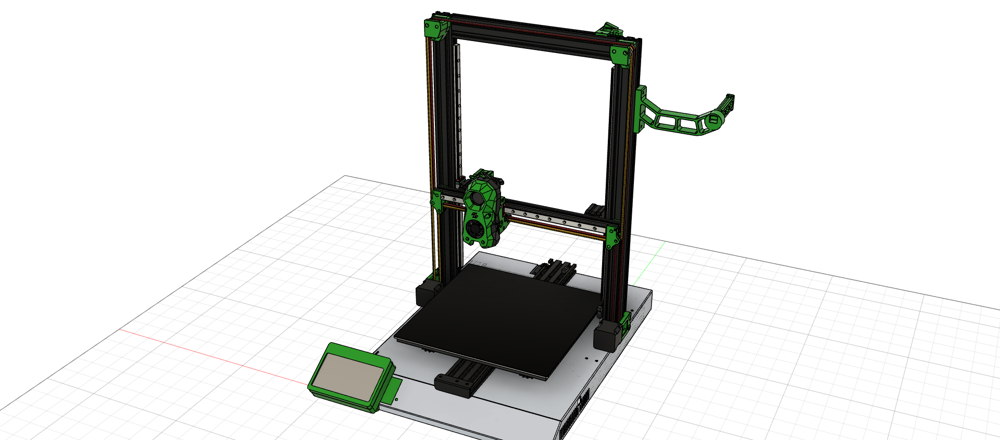
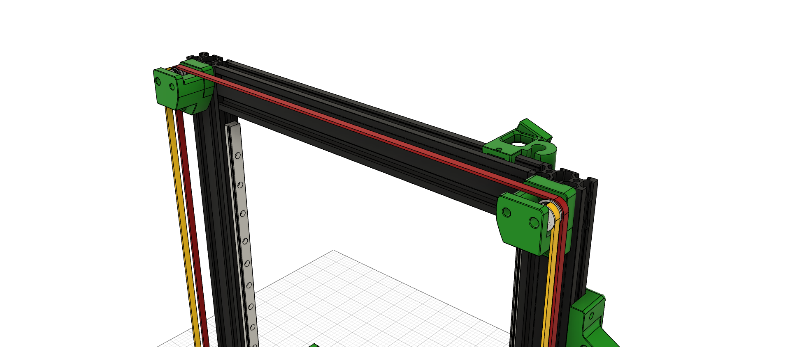
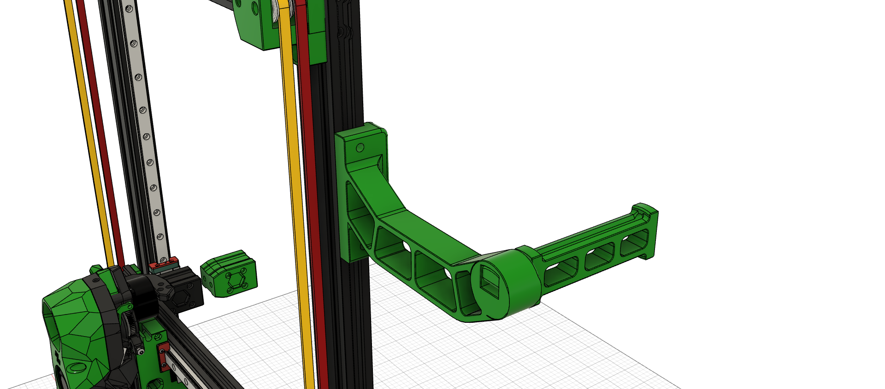
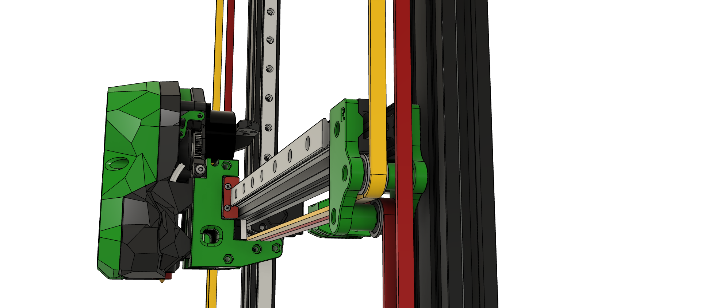
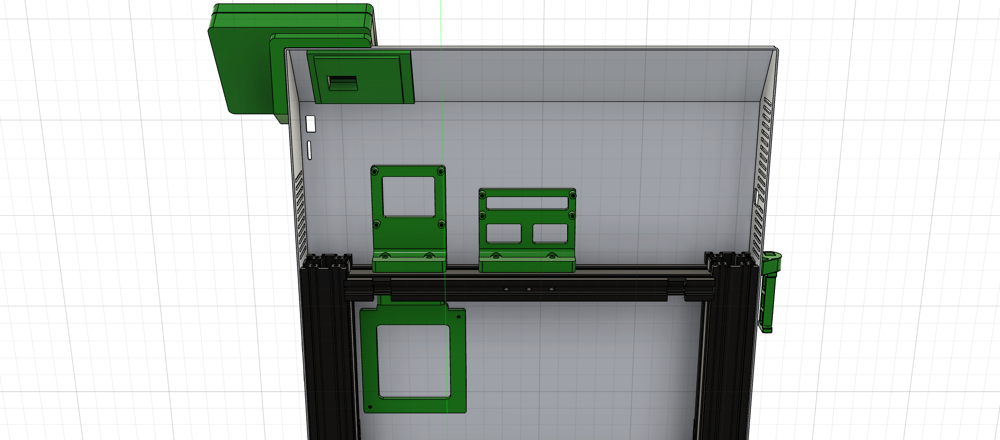
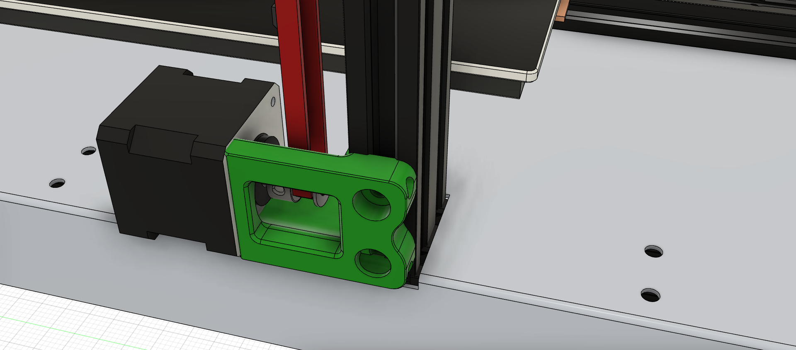

# 🚀 Artillery X1 → Voron Switchwire Conversion

This repository documents my journey converting my **Artillery X1** into a **Voron Switchwire**.

---

📜 Table of Contents (Click to expand)

- [📦 STLs](#-stls)
- [🖨️ Additional Printed Parts](#️-additional-printed-parts)
- [🛠 Build Plan](#-build-plan)
- [🔌 CAN Bus Setup](#-can-bus-setup)
- [🛤 MGN Rails](#-mgn-rails)
- [🍓 Raspberry Pi 4](#-raspberry-pi-4)
- [🖥 5" LCD – BTT TFT50](#-5-lcd--btt-tft50)
- [⚡ Power](#-power)
- [📏 2020 V-Slot Rail](#-2020-v-slot-rail)
- [🔩 Hardware](#-hardware)
- [🖼 Images](#-images)

---

## 📦 STLs
I have sourced, updated, and created everything needed for printing — **except** the Stealthburner:

🔗 [Voron Stealthburner](https://github.com/VoronDesign/Voron-Stealthburner)

---

## 🖨️ Additional Printed Parts

**BTT Cable Holders for CAN Bus Cable**  
- "CW2 cable bridge"  
- "Printed part for CAN cable"  
🔗 [BTT STL Files](https://github.com/bigtreetech/EBB/tree/master/EBB%20SB2240_2209%20CAN/STL)  

**Bowden Tube & CAN Bus Clips**  
🔗 [Printables Model](https://www.printables.com/model/741489-bowden-tube-and-canbus-usb-cable-support-clips/files)  

**Cable Clips for CAN Bus Wiring**  
🔗 [Printables Model](https://www.printables.com/model/538726-voron-2020-aluminum-profile-cable-clip-bigger-size)  

---

## 🛠 Build Plan

**To Keep**  
- 🖤 Base & frame  
- 🔥 Heatbed & glass bed *(will need a steel spring plate for Eddy sensor)*  
- ↔️ Y motion  
- ⬆️ Z steppers  
- 📟 MKS Gen L board & electronics  
- 📏 Optical endstops on Z & Y *(remove Z optical if using Eddy USB)*  

**To Add**  
- 🎭 Voron Stealthburner  
- 🧵 Voron Revo hotend  
- ⛔ Micro switch for X axis on toolhead  

---

## 🔌 CAN Bus Setup

- **BTT U2C USB Bridge**  
- **BTT EBB SB2209 RP2040**  
- Tutorial: [BTT EBB](https://github.com/bigtreetech/EBB)  

- **BTT Eddy Duo** (CAN Bus or USB)  
- Tutorial: [BTT Eddy](https://github.com/bigtreetech/Eddy)  
  - My Eddy coil uses I2C, so I wired it directly to the Raspberry Pi as the toolhead lacked I2C support.  

---

## 🛤 MGN Rails

- **Z Axis:** 2×MGN9 rails, 450mm  
- **X Axis:** 1×MGN12 rail, 350mm *(cut to 340mm)*  

---

## 🍓 Raspberry Pi 4

- Standard Raspberry Pi OS  
- Installed via [KIAUH](https://github.com/dw-0/kiauh) for Mainsail, Klipperscreen, Crowsnest, etc.  

---

## 🖥 5" LCD – BTT TFT50

- Remix of [this case](https://www.printables.com/model/198864-btt-tft50-v20-casehousing-mount-revision-2/files)  
- Remixed STLs are in the **electronics** folder  
- 30cm Raspberry Pi CSI cable  

---

## ⚡ Power

- 5V Meanwell PSU for Raspberry Pi  

---

## 📏 2020 V-Slot Rail

Replaces the 2060 X gantry:  
- 400mm cut to 380mm  

---

## 🔩 Hardware

**Screws & Inserts**  
- M5×45mm = 4  
- M5×16mm = 12 
- M5×30mm = 6  
- M3×18mm = get a pack of 50 (these are for the mgn rail )  
- M3 Drop-in T-nuts  
- M5 Drop-in T-nuts  
- M3 Heat-set inserts × 2 *(standard Voron size – for BTT50 mount)*  
- M3 Heat-set inserts x 4 for the switchwire mount that holds to the MGN rail

**Bearings & Belts**  
- **F695-2RS Bearings** = 16  
  - Or use this kit (6 tooth GT2 & 2 smooth): [AliExpress Link](https://www.aliexpress.com/item/1005005767406346.html)  
- GT2 Belt = 5m  

---

## 🖼 Images  

  
  
  
  
  
  

---
