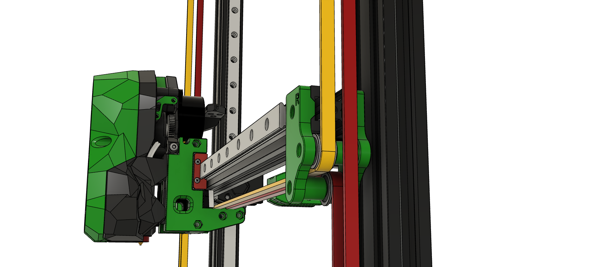

# ArtilleryX1-Switchwire

Repository to document my journey to convert my X1 to a Voron switchwire

### STL's are largely complete
I have sourced/updated, created everything needed to print out, with the exception of the stealthburner.
https://github.com/VoronDesign/Voron-Stealthburner

### You will also need the BTT cable holders for the canbus cable: 
"CW2 cable bridge" and "printed part for can cable"  
https://github.com/bigtreetech/EBB/tree/master/EBB%20SB2240_2209%20CAN/STL 
 
 
### I used these clips on the canbus cable and bowden tube:
https://www.printables.com/model/741489-bowden-tube-and-canbus-usb-cable-support-clips/files
 
 
 
### I also used these cable clips for the CanBus wiring 
https://www.printables.com/model/538726-voron-2020-aluminum-profile-cable-clip-bigger-size
 
 
 
### The plan:
keep the following:
  - base and frame
  - heatbed and glass bed *WIll need a steel sprung plate for Eddy sensor
  - Y motion
  - Z steppers
  - mks gen L board and electronics
  - Optical endstop on Z and Y

### To add:
- Voron Stealthburner
- Voron revo hotend
- micro switch for X on toolhead
  
### CanBus
  - BTT U2C USB bridge
  - BTT EBB sb2209 rp2040
  - BTT Eddy Duo (Canbus or USB)
    - I had a Eddy coil, so i wired that straight through to the Raspberry pi as the toolhead did not have i2c.   
  - MGN 9 Rails for X and Z
    - 450mm
  - MGN 12 Rail for Y
    - 350mm - cut down to 340mm 
  - Raspberry Pi 4
      - Standard RPI install with KIAUH install script to install mainsail, klipperscreen, crowsnest etc.
        - https://github.com/dw-0/kiauh
  - 5 Inch LCD - choose your own
      - I had a HDMI 5 inch for a Raspberry pi3 that i modded to fit, I had to mess around with HDMI adapters. I have left the stls in the folder for this one.
      - id probably go with a BTT TFT50, if i did another one as they have a DSI connection
  
  - 5 volt Meanwell power supply for Raspberry Pi

### 2020 Vslot rail  
  This replaces the 2060 X gantry
  - 400mm cut to 380mm

### Screws etc
- M5 x 45 = 4
- M5 x 16 = lots
- M5 x 30 = 6
- M3 x 12 = lots
- M3 Drop in place t nuts
- M5 Drop inplace t nuts

### Bearings 
F695-2rs = 16
Gt2 Belt = 5 metres

 
  
     
