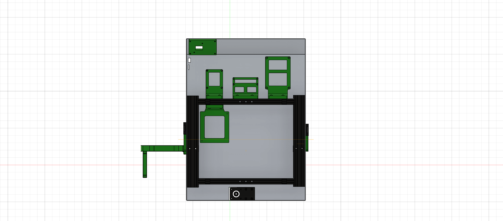
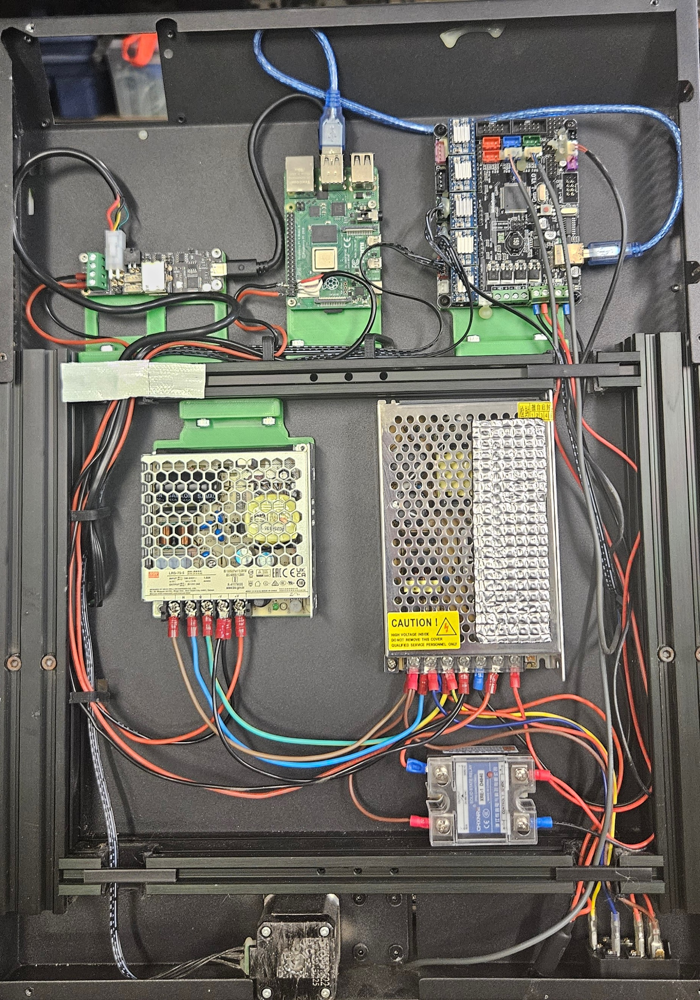

### Electronics mounting
- I used M5 drop in tnuts and M5x 20mm for the mounts
- I removed the welded mounts for the MKS GenL and used a printed mount. This gave acces to the USB port to be able to keep everything underneath.
- Dont forget your common ground between the 24v power and 5v power supplies

